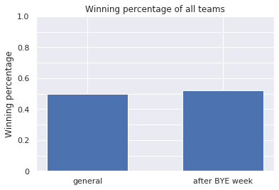
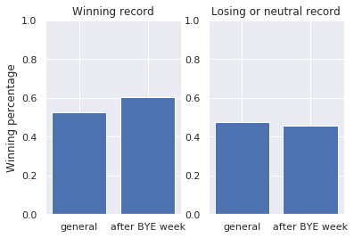
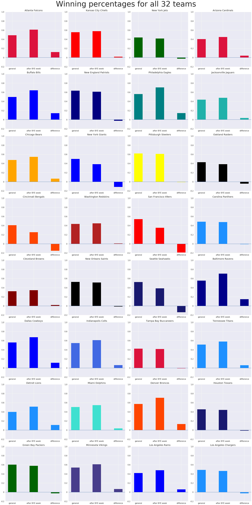

# Are NFL teams better after a BYE week?
* Analysed the performance of NFL teams after a BYE week 
* Used python and pandas to analyse the data

## Code and Resources Used
**Python Version:** 3.7  
**Packages**: pandas, pyplot, numpy  
**Dataset**: https://www.kaggle.com/tobycrabtree/nfl-scores-and-betting-data?select=spreadspoke_scores.csv   

## Data Cleaning
* deleted all games before season 1990 (BYE weeks have been introduced in 1990)  
* renamed the teams that have moved or changed their name in order to have uniform team names  
* set up a new column with the winner of the game
* set up new columns for the record (wins and losses in the season after that game) of the home and away team 

## Data Analysis
* created a dictionary with a list of games after a BYE week for each team
* calculated the overall winning percentage after a BYE week
* calculated the winning percentage after a BYE week for teams with a winning and neutral/losing record 
* calculated the winning percentage after a BYE week for each team seperately and compared it to their general winning percentage

## Results
* the overall winning percentage after a BYE week is only slightly larger than the general winning percentage (2%)
* the performance after a BYE week varies strongly from team to team
* teams with a winning record before are even more likely to win after a BYE week
* teams with a neutral or losing record are slightly less likely to win after BYE week
